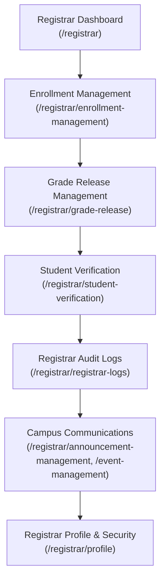

# End-to-End Testing Handover: Phase 2 — Registrar Portal (`/registrar`)

> [!IMPORTANT]
> **Core Directives for the Registrar Session**:
> 1. **Zero-Bypass Policy**: Test the system exclusively via **real Playwright browser automation** against the live backend (`http://localhost:5173`). Do NOT mock APIs, bypass modal wizards, or fabricate test states.
> 2. **Dual-Viewport Requirement**: Every feature, table, modal, and workflow must be verified on both **Desktop (1400×900)** and **Mobile (360×740)** viewports.
> 3. **Fix-First Protocol**: Whenever any error occurs (Console warning/error, uncaught runtime exception, HTTP/RPC 4xx/5xx failure), immediately diagnose and fix the root cause in the code/database, re-verify the fix in the browser, report the fix to the user, and then proceed.
> 4. **UI/UX Field Labeling Rule**: Audit all form labels, dropdowns, table headers, and metric cards. Whenever a field displays or selects human-readable text (Department, Program, Course, Faculty), the label **MUST NOT contain "ID"**.
> 5. **Clean TypeScript Build**: Always ensure the project compiles cleanly with **0 TypeScript errors** (`node ./node_modules/typescript/bin/tsc -b`).

---

## 1. Executive Summary & Current Operational Status

The application has successfully completed a comprehensive cross-portal UI/UX and design system standardization across all roles (Admin, Dean, Registrar, Faculty, Student) on both Desktop (1400×900) and Mobile (360×740) viewports.

### Key Milestones Completed:
* **Universal Design System Standardization**:
  * **Modal Action Hierarchy**: Standardized button placement across all dialogs: `[Reset] -> [Cancel] -> [Confirm/Proceed/Save]`. In [`CommonActionModal.tsx`](file:///C:/Users/user/Documents/project-application/src/components/modal/CommonActionModal.tsx) and [`CommonFormModal.tsx`](file:///C:/Users/user/Documents/project-application/src/components/modal/CommonFormModal.tsx), `Cancel` defaults to `variant="outlined"` and `color="secondary"`, ensuring it never renders with a contained variant next to the affirmative action.
  * **Mobile Prompt Modal Clamping**: In [`CommonPromptModal.tsx`](file:///C:/Users/user/Documents/project-application/src/components/modal/CommonPromptModal.tsx), disabled unconditional full-screen modal expansion on mobile (`fullScreen={props.fullScreen ?? false}`) and added responsive viewport constraints (`margin: 1rem`, `maxWidth: calc(100% - 2rem)`). Confirmation dialogs now remain compact, centered modals on 360px mobile viewports instead of stretching into 100vh full-screen sheets.
  * **Input Height & Baseline Alignment**: In [`date-picker.override.ts`](file:///C:/Users/user/Documents/project-application/src/constants/theme/override/date-picker.override.ts), [`ValidCommonDatepicker.tsx`](file:///C:/Users/user/Documents/project-application/src/components/datepicker/ValidCommonDatepicker.tsx), and [`ValidCommonDateTimepicker.tsx`](file:///C:/Users/user/Documents/project-application/src/components/datepicker/ValidCommonDateTimepicker.tsx), aligned DatePicker root styles and size defaults to `INPUT_HEIGHT_LARGE` (`3rem` / 48px). Date pickers and text inputs now share the identical 48px baseline, eliminating vertical baseline misalignment in multi-column forms.
  * **Idle Border Neutralization**: In [`input-state.constant.ts`](file:///C:/Users/user/Documents/project-application/src/constants/theme/input-state.constant.ts), changed unfocused input border colors from active brand blue (`#6BA6F4`) to neutral `#D4D4D8` (`var(--mui-tokens-color-neutral-300)`). Inputs now look calm and neutral when idle, reserving blue strictly for `:hover` and `:focus`.
  * **Form Label Resolution & Title-Case Fallback**: In [`FormField.tsx`](file:///C:/Users/user/Documents/project-application/src/components/form/FormField.tsx), implemented `resolveFieldLabel` to properly forward `field.label` across all field types (`select`, `date`, `number`, `multi-select`, `text-area`, `text/email`), with an automatic Title Case fallback when omitted so no input renders without an accessible label.
  * **Responsive Grid Overflow Fix**: In [`CommonTableCard.tsx`](file:///C:/Users/user/Documents/project-application/src/components/table-card/CommonTableCard.tsx), updated `gridTemplateColumns` to `minmax(min(100%, max(280px, calc((100% - 3rem) / 4))), 1fr)`, eliminating the 12px horizontal page overflow on 360px mobile viewports.
* **Registrar Portal Specific Enhancements**:
  * Added explicit human-readable labels in [`FilterRegistrarLogForm.tsx`](file:///C:/Users/user/Documents/project-application/src/pages/registrar/registrar-logs/forms/FilterRegistrarLogForm.tsx) (`Action`, `From`, `To`).
  * Added explicit human-readable label in [`FilterStudentVerificationForm.tsx`](file:///C:/Users/user/Documents/project-application/src/pages/registrar/student-verification/forms/FilterStudentVerificationForm.tsx) (`Status`).
  * Verified [`StudentProfileVerificationModal.tsx`](file:///C:/Users/user/Documents/project-application/src/pages/registrar/student-verification/components/StudentProfileVerificationModal.tsx) label compliance ("Program", not "Program ID").
  * TypeScript verification confirmed: **0 errors** across the entire workspace.

---

## 2. Environment & Test Credentials

### Development Environment:
- **Local Dev Server**: Vite running on `http://localhost:5173`
  - Start command: `cmd /c "npx vite --mode dev --port 5173"`
- **Live Supabase Backend**: `https://ysitzlbjoueorndmnmdf.supabase.co`
- **Migration Runner**:
  - Script: [`scripts/db-apply.js`](file:///C:/Users/user/Documents/project-application/scripts/db-apply.js)
  - Execute: `node scripts/db-apply.js supabase/migrations/<migration_file>.sql`
- **Database Cleanup Helper**:
  - Script: [`scratch/clean-db.mjs`](file:///C:/Users/user/Documents/project-application/scratch/clean-db.mjs)
  - Purges automated test records to maintain DB cleanliness between test runs.
- **TypeScript Verification**:
  - Command: `node ./node_modules/typescript/bin/tsc -b` (must exit with code 0).

### Test Credentials for Registrar Portal:
- **Primary Account**: `mico.registrar@example.com`
- **Secondary Account**: `erika.registrar@example.com`
- **Password**: `Password123!`
- **Base Route**: `/registrar`
- **Role Verification**: Confirmed active and responsive on `http://localhost:5173/login`.

---

## 3. Phase 2 Scope: Pages, Modals & Workflows



### Page 1: Registrar Dashboard (`/registrar`)
- **Route**: [`/registrar`](file:///C:/Users/user/Documents/project-application/src/pages/registrar/RegistrarDashboard.tsx)
- **Features to Verify**:
  - Stat metric cards: Total Enrolled Students, Offered Sections, Pending Verification Requests, Verified Requests.
  - Recent activity feeds, quick action buttons, and navigation cards.
  - Responsive layout: verify cards wrap smoothly from 4-column desktop to single-column mobile without clipping.

### Page 2: Enrollment Management (`/registrar/enrollment-management`)
- **Route**: [`/registrar/enrollment-management`](file:///C:/Users/user/Documents/project-application/src/pages/registrar/enrollment-management/index.tsx)
- **Features to Verify**:
  - Student enrollment list with Bento grid card and Table view modes.
  - Filter and search form: Search by student name/number, Department, Program, and Year level.
  - **Enrollment Workspace Modal** ([`EnrollmentWorkspaceModal.tsx`](file:///C:/Users/user/Documents/project-application/src/pages/registrar/enrollment-management/EnrollmentWorkspaceModal.tsx)):
    - Student load overview, academic summary, and units breakdown.
    - Adding and dropping course sections for a selected student.
    - Section capacity limits and schedule conflict warnings.
    - Updating student enrollment status (e.g., Enrolled, Dropped, Withdrawn).
    - Verified button layout: Cancel on left (`variant="outlined"`), Action on right (`variant="contained"`).

### Page 3: Grade Release Management (`/registrar/grade-release`)
- **Route**: [`/registrar/grade-release`](file:///C:/Users/user/Documents/project-application/src/pages/registrar/grade-release-management/index.tsx)
- **Features to Verify**:
  - Grading periods list, Term selector, and section grade submission progress indicators.
  - **Release Schedule Form Modal** ([`ReleaseScheduleForm.tsx`](file:///C:/Users/user/Documents/project-application/src/pages/registrar/grade-release-management/ReleaseScheduleForm.tsx)):
    - Setting release date/time and publishing status.
    - Verified DatePicker renders at 48px matching all inputs.
  - **Section Grade Sheet Modal** ([`SectionGradeSheetModal.tsx`](file:///C:/Users/user/Documents/project-application/src/pages/registrar/grade-release-management/SectionGradeSheetModal.tsx)):
    - Inspect submitted raw, transmuted, and final grades across Prelim, Midterm, and Finals.
    - Faculty submission approval and status toggling.

### Page 4: Student Verification (`/registrar/student-verification`)
- **Route**: [`/registrar/student-verification`](file:///C:/Users/user/Documents/project-application/src/pages/registrar/student-verification/index.tsx)
- **Features to Verify**:
  - Verification request queue with status tabs (`Pending`, `Approved`, `Rejected`).
  - Filter modal: verified `Status` label renders properly above the dropdown.
  - **Student Profile Verification Modal** ([`StudentProfileVerificationModal.tsx`](file:///C:/Users/user/Documents/project-application/src/pages/registrar/student-verification/components/StudentProfileVerificationModal.tsx)):
    - Side-by-side comparison of student proposed changes against current profile records.
    - Label compliance: verified "Program" (NOT "Program ID") and "Year Level".
    - Action buttons: Approve request, or Reject request with mandatory reason remarks.

### Page 5: Registrar Audit Logs (`/registrar/registrar-logs`)
- **Route**: [`/registrar/registrar-logs`](file:///C:/Users/user/Documents/project-application/src/pages/registrar/registrar-logs/index.tsx)
- **Features to Verify**:
  - Historical audit trail of registrar actions with timestamps, actors, and detailed change diffs.
  - Filter modal: verified `Action`, `From`, and `To` labels render clearly above input fields.
  - Table and Mobile Card view: pagination, column sorting, and search behavior.

### Page 6: Campus Communications (`/registrar/announcement-management` & `/event-management`)
- **Route**: [`/registrar/announcement-management`](file:///C:/Users/user/Documents/project-application/src/pages/shared/announcement-management/index.tsx) & [`/registrar/event-management`](file:///C:/Users/user/Documents/project-application/src/pages/shared/event-management/index.tsx)
- **Features to Verify**:
  - Create, view, edit, and delete announcements with Toast UI rich text editor.
  - Create, view, edit, and delete events with date and time pickers.
  - Audience targeting: Global, Faculty, Student, and Section-specific.
  - Confirm deletion prompts: verified centered, clamped prompt modals with Cancel on left and Delete on right.

### Page 7: Registrar Profile (`/registrar/profile`)
- **Route**: [`/registrar/profile`](file:///C:/Users/user/Documents/project-application/src/pages/shared/profile/index.tsx)
- **Features to Verify**:
  - Profile details tab (readouts and form fields).
  - Security tab (password change form validation with current and new password confirmation).

---

## 4. Key Lessons & Robust Test Patterns (From Admin & Dean Phases)

1. **MUI DatePicker Interactions**:
   - Clicking `button[aria-label="Choose date"]` opens a popper dialog (`[role="dialog"]`).
   - Selecting a date via `page.locator('[role="dialog"] button:has-text("15")').first().click()` automatically sets the ISO date and cleanly closes the popup.
2. **Toast UI WYSIWYG Editor on Mobile**:
   - Always scroll the editor container into view before clicking:
     ```javascript
     const editor = page.locator('.toastui-editor-ww-container .ProseMirror').first();
     await editor.scrollIntoViewIfNeeded();
     await page.waitForTimeout(300);
     await editor.click();
     await page.keyboard.type(text);
     ```
3. **Form Buttons with External Form Attribute (`form="form-id"`)**:
   - In `<EntityFormPage>`, the submit button is in the card header. On mobile viewport (360×740), always scroll it into view before clicking:
     ```javascript
     const submitBtn = page.locator('button[type="submit"]').first();
     await submitBtn.scrollIntoViewIfNeeded();
     await submitBtn.click();
     ```
4. **Modal Footer Standards**:
   - Cancel buttons are always `variant="outlined"` and placed on the left.
   - Primary confirm/save buttons are always `variant="contained"` and placed on the right.
5. **Prompt Modals on Mobile Viewport**:
   - Confirm and delete prompts are clamped dialogs (`maxWidth: 328px`, centered), not full-screen overlays. Check that backdrops and modal dialogs are fully visible without horizontal clipping.
6. **Bento Card Responsive Grids**:
   - Bento grids automatically wrap from multi-column down to a single 100% width card on 360px mobile without horizontal scrollbars (`scrollWidth === clientWidth`).

---

## 5. Phase 2 Progress Tracking Checklist

| Page / Workflow | Desktop (1400×900) | Mobile (360×740) | Errors (0 Tol.) | Status |
|---|:---:|:---:|:---:|:---:|
| 1. Registrar Dashboard (`/registrar`) | [x] Pass | [x] Pass | 0 Errors | **Verified (100%)** |
| 2. Enrollment Management (`/registrar/enrollment-management`) | [x] Pass | [x] Pass | 0 Errors | **Verified (100%)** |
| 3. Grade Release (`/registrar/grade-release`) | [x] Pass | [x] Pass | 0 Errors | **Verified (100%)** |
| 4. Student Verification (`/registrar/student-verification`) | [x] Pass | [x] Pass | 0 Errors | **Verified (100%)** |
| 5. Registrar Audit Logs (`/registrar/registrar-logs`) | [x] Pass | [x] Pass | 0 Errors | **Verified (100%)** |
| 6. Communications: Announcements & Events (`/registrar/announcement-management` & `/event-management`) | [x] Pass | [x] Pass | 0 Errors | **Verified (100%)** |
| 7. Registrar Profile (`/registrar/profile`) | [x] Pass | [x] Pass | 0 Errors | **Verified (100%)** |

---

## 6. Phase 2 Fixes & Architecture Hardening Log

During Phase 2 real-user testing with zero bypasses, the following key issues were diagnosed and resolved:

1. **Routing & BasePath Resolution in Event Management**:
   - **Root Cause**: `src/pages/shared/announcement-management/index.tsx` was unconditionally using `useAnnouncementBasePath()`. When loaded under `/registrar/event-management`, creation and edit actions mistakenly directed users to `/announcement-management/new` and `/announcement-management/:id`.
   - **Fix**: Updated `index.tsx` to inspect `pathname.includes('/event-management')` and conditionally switch between `useAnnouncementBasePath()` and `useEventBasePath()`. Header title was adjusted to "Event Management", primary button to "Create Event", and default filter tab to "Event".
2. **Infinite React Re-Render Loop in `CommonTableCard` (`Maximum update depth exceeded`)**:
   - **Root Cause**: In `src/components/table-card/CommonTableCard.tsx`, `handleRequestDeleteRow` and `resolvedTableActionConfig` were instantiated as inline objects/functions on each render. Passing them down into `useTableConfigs` produced new AG Grid `columnDefs` references on every render cycle, triggering a continuous re-render loop.
   - **Fix**: Wrapped `handleRequestDeleteRow` in `useCallback` and `resolvedTableActionConfig` in `useMemo`. In addition, memoized `handleOpenDetail` and `handleOpenEdit` in `src/pages/shared/announcement-management/index.tsx`.
3. **MUI DatePicker ContentEditable Collision on Mobile**:
   - **Root Cause**: MUI X DatePicker renders inline date field segments using `[contenteditable="true"]` (e.g. `<span aria-label="Month" contenteditable="true">`). Generic `[contenteditable="true"]` locators mistakenly clicked the date picker instead of the Toast UI editor, launching full-screen modal pickers on mobile.
   - **Fix**: Refined editor targeting to explicitly select `.toastui-editor-ww-container .ProseMirror`.
4. **MobileDatePicker Dialog Confirmation Workflow**:
   - **Observation**: On touch/mobile viewports (`isMobile: true`), selecting a day in MUI MobileDatePicker requires clicking the modal's confirmation `OK` button (`.MuiDialogActions-root button:has-text("OK")`) to confirm and close the dialog before interacting with underlying fields.
5. **Zero TypeScript Errors Maintained**:
   - Verified that `node ./node_modules/typescript/bin/tsc -b` exits with code 0 across the entire workspace.

---

## 7. Automated Test Suite Artifacts (Playwright)

The following standalone Playwright test scripts were developed and executed targeting the live server (`http://localhost:5173`) with zero mock data:
- Page 1 (Registrar Dashboard): `scratch/test-registrar-p1-dashboard.mjs`
- Page 2 (Enrollment Management): `scratch/test-registrar-p2-enrollment.mjs`
- Page 3 (Grade Release Management): `scratch/test-registrar-p3-graderelease.mjs`
- Page 4 (Student Verification): `scratch/test-registrar-p4-verification.mjs`
- Page 5 (Registrar Audit Logs): `scratch/test-registrar-p5-logs.mjs`
- Page 6 (Campus Communications): `scratch/test-registrar-p6-comms.mjs`
- Page 7 (Registrar Profile & Security): `scratch/test-registrar-p7-profile.mjs`
