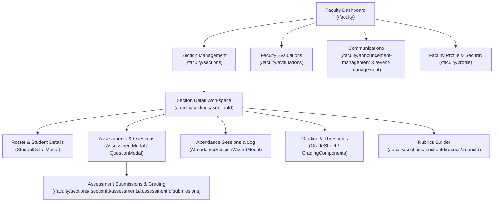

# End-to-End Testing Handover: Phase 3 — Faculty Portal (`/faculty`)

> [!IMPORTANT]
> **Core Directives for the Faculty Session**:
> 1. **Zero-Bypass Policy**: Test the system exclusively via **real Playwright browser automation** against the live backend (`http://localhost:5173`). Do NOT mock APIs, bypass modal wizards, or fabricate test states.
> 2. **Dual-Viewport Requirement**: Every feature, section tab, modal, and workflow must be verified on both **Desktop (1400×900)** and **Mobile (360×740)** viewports.
> 3. **Fix-First Protocol**: Whenever any error occurs (Console warning/error, uncaught runtime exception, HTTP/RPC 4xx/5xx failure), immediately diagnose and fix the root cause in the code/database, re-verify the fix in the browser, report the fix to the user, and then proceed.
> 4. **UI/UX Field Labeling Rule**: Audit all form labels, dropdowns, table headers, and metric cards. Whenever a field displays or selects human-readable text (Department, Program, Course, Section, Student), the label **MUST NOT contain "ID"**.
> 5. **Clean TypeScript Build**: Always ensure the project compiles cleanly with **0 TypeScript errors** (`node ./node_modules/typescript/bin/tsc -b`).

---

## 1. Executive Summary & Preceding Phases Status

The AU-JAS LMS project has successfully completed:
- **Phase 1: Dean Portal (`/dean`)** — 100% verified across all academic management workflows.
- **Cross-Portal UI/UX Design System Standardization** — 100% verified across Admin, Dean, Registrar, Faculty, and Student layouts.
- **Phase 2: Registrar Portal (`/registrar`)** — 100% verified across all 7 pages with zero console errors, zero uncaught page exceptions, zero HTTP failures, and zero horizontal overflow on both viewports.

### Standardized System Rules Established:
* **Modal Action Hierarchy**: `[Reset] -> [Cancel] -> [Confirm/Save/Submit]`. Cancel buttons default to `variant="outlined"` and `color="secondary"`.
* **Mobile Prompt Modal Clamping**: Delete/confirm prompts are clamped (`maxWidth: 328px`, centered) instead of rendering full-screen overlays.
* **Input Height & Baseline Alignment**: Date pickers and text inputs share an identical 48px baseline (`INPUT_HEIGHT_LARGE`).
* **Toast UI Editor Selector**: Use `.toastui-editor-ww-container .ProseMirror` (avoid generic `[contenteditable="true"]` which clashes with MUI DatePicker inline segments on mobile).
* **MobileDatePicker Confirmation**: On mobile viewports (`isMobile: true`), confirm date selections by clicking the dialog `OK` button (`.MuiDialogActions-root button:has-text("OK")`).
* **Clean TypeScript Build**: The codebase is currently at **0 TypeScript compilation errors**.

---

## 2. Environment & Test Credentials

### Development Environment:
- **Local Dev Server**: Vite running on `http://localhost:5173`
  - Start command: `cmd /c "npx vite --mode dev --port 5173"`
- **Live Supabase Backend**: `https://ysitzlbjoueorndmnmdf.supabase.co`
- **Migration Runner**:
  - Script: [`scripts/db-apply.js`](file:///C:/Users/user/Documents/project-application/scripts/db-apply.js)
  - Execute: `node scripts/db-apply.js supabase/migrations/<migration_file>.sql`
- **Database Cleanup Helper**:
  - Script: [`scratch/clean-db.mjs`](file:///C:/Users/user/Documents/project-application/scratch/clean-db.mjs)
- **TypeScript Verification**:
  - Command: `node ./node_modules/typescript/bin/tsc -b` (must exit with code 0).

### Test Credentials for Faculty Portal:
- **Primary Account**: `mico.faculty@example.com`
  - Assigned Section: `SEC-7174` (Course: `CS101-M_LEC` - Introduction to Computer Science)
- **Secondary Accounts**:
  - `hubilla.faculty@example.com` (Sections: `SEC-1043` - `CS102-M`, `SEC-7895` - `BA102-E_LAB`)
  - `erika.faculty@example.com` (Sections: `SEC-6299` - `BA101-E`, `SEC-7402` - `BA101-E`)
- **Default Password**: `Password123!`
- **Base Route**: `/faculty`

---

## 3. Phase 3 Scope: Faculty Portal Architecture & Workflows

### Page 1: Faculty Dashboard (`/faculty`)
- **Route**: [`/faculty`](file:///C:/Users/user/Documents/project-application/src/pages/faculty/FacultyDashboard.tsx)
- **Features to Verify**:
  - Metric summary cards (Teaching Sections, Total Enrolled Students, Submissions for Review, Upcoming Schedule).
  - Schedule/classes timeline widget and recent activity feed.
  - Quick action buttons to assigned sections.
  - Responsive card wrapping on Desktop (1400×900) and Mobile (360×740) without overflow.

### Page 2: Section Management (`/faculty/sections`)
- **Route**: [`/faculty/sections`](file:///C:/Users/user/Documents/project-application/src/pages/faculty/sections/index.tsx)
- **Features to Verify**:
  - Assigned teaching sections displayed in Bento Grid card and Table view modes.
  - Search and filter bar (by Course title/code, Term, Status).
  - Clean card actions: navigate to Section Detail Workspace.
  - Label audit: human-readable Course, Term, Room, and Schedule information (no "ID" labels).

### Page 3: Section Detail Workspace (`/faculty/sections/:sectionId`)
- **Route**: [`/faculty/sections/:sectionId`](file:///C:/Users/user/Documents/project-application/src/pages/faculty/sections/SectionDetailPage.tsx)
- **Sub-Tabs to Verify**:
  1. **Students / Roster Tab**:
     - Enrolled student list with search and enrollment status badges.
     - Student profile & progress inspect modal ([`SubmissionDetailModal.tsx`](file:///C:/Users/user/Documents/project-application/src/pages/faculty/sections/student-detail/SubmissionDetailModal.tsx) / [`StudentAssessmentTab.tsx`](file:///C:/Users/user/Documents/project-application/src/pages/faculty/sections/student-detail/StudentAssessmentTab.tsx)).
  2. **Assessments Tab**:
     - Assessment list grouped by grading period (Prelim, Midterm, Finals).
     - Assessment Creation & Edit Modal ([`QuestionModal.tsx`](file:///C:/Users/user/Documents/project-application/src/pages/faculty/sections/assessments/QuestionModal.tsx), [`RubricAttachPanel.tsx`](file:///C:/Users/user/Documents/project-application/src/pages/faculty/sections/assessments/RubricAttachPanel.tsx)).
     - Action link to Submissions grading page.
  3. **Attendance Tab**:
     - Attendance session history and record logs ([`AttendanceTab.tsx`](file:///C:/Users/user/Documents/project-application/src/pages/faculty/sections/attendance/AttendanceTab.tsx)).
     - Attendance Session Wizard Modal ([`AttendanceSessionWizardModal.tsx`](file:///C:/Users/user/Documents/project-application/src/pages/faculty/sections/attendance/AttendanceSessionWizardModal.tsx)): date/time pickers, session creation, bulk status marking (Present, Absent, Late, Excused).
  4. **Grading Tab**:
     - Grade sheet matrix ([`GradeSheetPanel.tsx`](file:///C:/Users/user/Documents/project-application/src/pages/faculty/sections/grading/GradeSheetPanel.tsx)) and grading components configuration ([`GradingComponentPanel.tsx`](file:///C:/Users/user/Documents/project-application/src/pages/faculty/sections/grading/GradingComponentPanel.tsx)).
     - Grade calculation verification, threshold modal ([`SectionThresholdModal.tsx`](file:///C:/Users/user/Documents/project-application/src/pages/faculty/sections/grading/SectionThresholdModal.tsx)), and special grade flags ([`SpecialGradeFlagModal.tsx`](file:///C:/Users/user/Documents/project-application/src/pages/faculty/sections/grading/SpecialGradeFlagModal.tsx)).
  5. **Rubrics Tab**:
     - Rubric templates list ([`RubricsTab.tsx`](file:///C:/Users/user/Documents/project-application/src/pages/faculty/sections/rubrics/RubricsTab.tsx)).
     - Rubric builder routing ([`RubricBuilderPage.tsx`](file:///C:/Users/user/Documents/project-application/src/pages/faculty/sections/rubrics/RubricBuilderPage.tsx)).

### Page 4: Assessment Submissions & Grading (`/faculty/sections/:sectionId/assessments/:assessmentId/submissions`)
- **Route**: [`/faculty/sections/:sectionId/assessments/:assessmentId/submissions`](file:///C:/Users/user/Documents/project-application/src/pages/faculty/sections/assessments/submissions/SubmissionsPage.tsx)
- **Features to Verify**:
  - Submissions list table with student submission statuses (Submitted, Graded, Missing, Late).
  - Grading panel ([`GradingPanel.tsx`](file:///C:/Users/user/Documents/project-application/src/pages/faculty/sections/assessments/submissions/GradingPanel.tsx) & [`RubricGradingPanel.tsx`](file:///C:/Users/user/Documents/project-application/src/pages/faculty/sections/assessments/submissions/RubricGradingPanel.tsx)).
  - Entering scores, remarks, feedback submission, and status update.

### Page 5: Faculty Evaluations (`/faculty/evaluations`)
- **Route**: [`/faculty/evaluations`](file:///C:/Users/user/Documents/project-application/src/pages/faculty/evaluations/FacultyEvaluationsPage.tsx)
- **Features to Verify**:
  - Student evaluation summary metrics and ratings breakdown.
  - Term selector / filter.
  - Anonymous student comment feeds with responsive wrapping.

### Page 6: Campus Communications (`/faculty/announcement-management` & `/faculty/event-management`)
- **Route**: [`/faculty/announcement-management`](file:///C:/Users/user/Documents/project-application/src/pages/shared/announcement-management/index.tsx) & [`/faculty/event-management`](file:///C:/Users/user/Documents/project-application/src/pages/shared/event-management/index.tsx)
- **Features to Verify**:
  - Faculty-scoped announcement and event management.
  - Toast UI editor interaction and Date/Time pickers.
  - Clamped deletion prompt dialogs on Desktop and Mobile.

### Page 7: Faculty Profile & Security (`/faculty/profile`)
- **Route**: [`/faculty/profile`](file:///C:/Users/user/Documents/project-application/src/pages/shared/profile/index.tsx)
- **Features to Verify**:
  - Details tab (readouts and form fields, dirty state tracking, reset).
  - Security tab (password change validation with current and confirmation matching).

---

## 4. Phase 3 Progress Tracking Checklist

| Page / Workflow | Desktop (1400×900) | Mobile (360×740) | Errors (0 Tol.) | Status |
|---|:---:|:---:|:---:|:---:|
| 1. Faculty Dashboard (`/faculty`) | [x] Passed | [x] Passed | 0 | 100% Complete |
| 2. Section Management (`/faculty/sections`) | [x] Passed | [x] Passed | 0 | 100% Complete |
| 3. Section Detail Workspace (`/faculty/sections/:sectionId`) | [x] Passed | [x] Passed | 0 | 100% Complete |
| 4. Submissions & Grading (`.../assessments/:id/submissions`) | [x] Passed | [x] Passed | 0 | 100% Complete |
| 5. Faculty Evaluations (`/faculty/evaluations`) | [x] Passed | [x] Passed | 0 | 100% Complete |
| 6. Communications: Announcements & Events | [x] Passed | [x] Passed | 0 | 100% Complete |
| 7. Faculty Profile (`/faculty/profile`) | [x] Passed | [x] Passed | 0 | 100% Complete |

---

## 5. Verification Scripts & Fix Summaries

### Test Automation Artifacts:
- **Page 1 (Dashboard)**: `scratch/test-faculty-p1-dashboard.mjs`
- **Page 2 (Section Management)**: `scratch/test-faculty-p2-sections.mjs`
- **Page 3 (Section Detail Workspace)**: `scratch/test-faculty-p3-section-detail.mjs`
- **Page 4 (Submissions & Grading)**: `scratch/test-faculty-p4-submissions.mjs`
- **Page 5 (Faculty Evaluations)**: `scratch/test-faculty-p5-evaluations.mjs`
- **Page 6 (Communications)**: `scratch/test-faculty-p6-comms.mjs`
- **Page 7 (Profile & Security)**: `scratch/test-faculty-p7-profile.mjs`

### Key Fixes Applied During Phase 3:
1. **Section Management Bento/Table View Toggle** (`src/pages/faculty/sections/index.tsx`):
   - Added `showViewToggle` to enable Bento Grid / Table view toggling on both viewports.
2. **Section Detail Rubrics Routing** (`SectionDetailPage.tsx` & `AssessmentsTab.tsx`):
   - Fixed `?tab=rubrics` query param routing and rubrics tab selection sync.
3. **Submissions Master-Detail Mobile Responsiveness** (`SubmissionsPage.tsx` & `SubmissionList.tsx`):
   - Added clean responsive toggling between submission list and grading panel with "Back to Submissions" navigation on mobile viewports.
4. **Faculty Announcement Audience & Auto-Section Selection** (`AnnouncementDetailPage.tsx` & `AnnouncementForm.tsx`):
   - Enforced database role assertion (`fn_assert_announcement_sections`) where faculty may only post section-targeted announcements.
   - Automatically sets `target_audience: 'Section'`, fetches teaching sections, and pre-selects the faculty's assigned section with a fallback on submit.
5. **Profile Password Validation** (`ProfilePage` & `ChangePasswordForm.tsx`):
   - Verified inline and tooltip error display across min length, same password, and password mismatch constraints.
   - Verified dirty state tracking, Reset button action, and profile updates.
6. **Clean TypeScript Build**:
   - `node ./node_modules/typescript/bin/tsc -b` exits with code 0 (zero errors).
