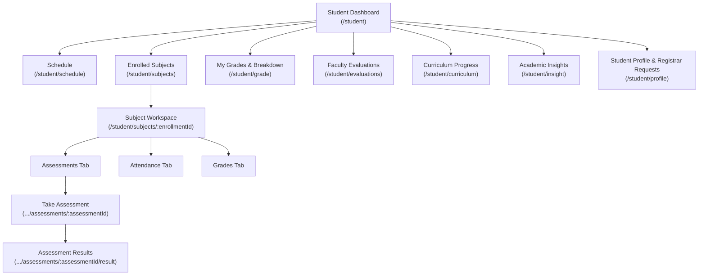

# End-to-End Testing Handover: Phase 4 — Student Portal (`/student`)

> [!IMPORTANT]
> **Core Directives for the Student Session**:
> 1. **Zero-Bypass Policy**: Test the system exclusively via **real Playwright browser automation** using `channel: 'chrome'` against the live backend (`http://localhost:5173`). Do NOT mock APIs, bypass question forms, or fake submission states.
> 2. **Dual-Viewport Requirement**: Every feature, subject tab, assessment form, modal, and workflow must be verified on both **Desktop (1400×900)** and **Mobile (360×740)** viewports.
> 3. **Fix-First Protocol**: Whenever any error occurs (Console warning/error, uncaught runtime exception, HTTP/RPC 4xx/5xx failure), immediately diagnose and fix the root cause in the frontend code or database migrations, re-verify the fix in the browser, report the fix, and then proceed.
> 4. **UI/UX Field Labeling Rule**: Audit all form labels, dropdowns, table headers, and metric cards. Whenever a field displays or selects human-readable text (Course, Subject, Term, Program, Faculty), the label **MUST NOT contain "ID"**.
> 5. **Clean TypeScript Build**: Always ensure the project compiles cleanly with **0 TypeScript errors** (`node ./node_modules/typescript/bin/tsc -b`).

---

## 1. Executive Summary & Preceding Phases Status

The AU-JAS LMS project has successfully completed:
- **Phase 1: Dean Portal (`/dean`)** — 100% verified across all academic management workflows.
- **Cross-Portal UI/UX Design System Standardization** — 100% verified across all 5 user roles (Admin, Dean, Registrar, Faculty, Student).
- **Phase 2: Registrar Portal (`/registrar`)** — 100% verified across all 7 pages with zero errors and zero horizontal overflow.
- **Phase 3: Faculty Portal (`/faculty`)** — 100% verified across all 7 pages (Dashboard, Sections, Workspace Tabs, Submissions & Grading, Evaluations, Communications, Profile & Security).

### Standardized System Rules Established:
* **Modal Action Hierarchy**: `[Reset] -> [Cancel] -> [Confirm/Save/Submit]`. Cancel buttons default to `variant="outlined"` and `color="secondary"`.
* **Mobile Prompt Modal Clamping**: Delete/confirm prompts are clamped (`maxWidth: 328px`, centered) rather than rendering unconstrained overlays.
* **Input Height & Baseline Alignment**: Date pickers and text inputs share an identical 48px baseline (`INPUT_HEIGHT_LARGE`).
* **Toast UI Editor Selector**: Use `.toastui-editor-ww-container .ProseMirror` (avoid generic `[contenteditable="true"]` which clashes with MUI DatePicker inline segments on mobile).
* **MobileDatePicker Confirmation**: On mobile viewports (`isMobile: true`), confirm date selections by clicking the dialog `OK` button (`.MuiDialogActions-root button:has-text("OK")`).
* **Clean TypeScript Build**: The codebase compiles with **0 TypeScript compilation errors**.

---

## 2. Environment & Test Credentials

### Development Environment:
- **Local Dev Server**: Vite running on `http://localhost:5173`
  - Start command: `cmd /c "npx vite --mode dev --port 5173"`
- **Live Supabase Backend**: Connected via remote Supabase pooler
- **TypeScript Verification**:
  - Command: `node ./node_modules/typescript/bin/tsc -b` (must exit with code 0).

### Test Credentials for Student Portal:
- **Primary Account**: `mico.student@example.com`
  - Student Number: `2026-0101`
  - Enrolled Section: `SEC-7174` (Course: `CS101-M_LEC` — Introduction to Computer Science)
  - Enrollment ID: `3e360053-cd08-4b7e-ae71-bb7b68348308`
- **Secondary Account**: `student.dummy@example.com`
  - Student Number: `2026-0006`
  - Enrolled Section: `SEC-7404` (Course: `PSY101-J` — Introduction to Psychology)
  - Enrollment ID: `f75bf48f-6335-4f58-ae4e-a2a64e3b4a94`
- **Default Password**: `Password123!`
- **Base Route**: `/student`

---

## 3. Phase 4 Scope: Student Portal Architecture & Workflows

### Page 1: Student Dashboard (`/student`)
- **Route**: [`/student`](file:///C:/Users/user/Documents/project-application/src/pages/student/StudentDashboard.tsx)
- **Features to Verify**:
  - Metric summary cards (Enrolled Subjects, Current GPA/GWA, Attendance Rate, Upcoming Deadlines).
  - Schedule/classes timeline widget for today's classes.
  - Quick action links to enrolled subjects.
  - Announcements feed and notification cards.
  - Responsive card wrapping on Desktop (1400×900) and Mobile (360×740) without overflow.

### Page 2: Student Schedule (`/student/schedule`)
- **Route**: [`/student/schedule`](file:///C:/Users/user/Documents/project-application/src/pages/student/schedule/index.tsx)
- **Features to Verify**:
  - Class schedule calendar and timeline grid by day and time slots.
  - Subject details popover/modal: Course name, section, room, instructor name.
  - Responsive timetable layout on mobile without clipping.

### Page 3: Enrolled Subjects & Workspace (`/student/subjects` & `/student/subjects/:enrollmentId`)
- **Route**: [`/student/subjects`](file:///C:/Users/user/Documents/project-application/src/pages/student/subject/index.tsx) & [`/student/subjects/:enrollmentId`](file:///C:/Users/user/Documents/project-application/src/pages/student/subject/SubjectDetailPage.tsx)
- **Features to Verify**:
  - Subjects listing card grid / table with instructor, schedule, units.
  - Navigation to Subject Detail Workspace.
  - Sub-Tabs:
    1. **Assessments Tab** ([`SubjectAssessmentList.tsx`](file:///C:/Users/user/Documents/project-application/src/pages/student/subject/SubjectAssessmentList.tsx)): Upcoming, Submitted, and Graded assessments.
    2. **Attendance Tab** ([`SubjectAttendanceList.tsx`](file:///C:/Users/user/Documents/project-application/src/pages/student/subject/SubjectAttendanceList.tsx)): Session attendance logs (Present, Absent, Late, Excused) and percentage.
    3. **Grades Tab** ([`SubjectGradeList.tsx`](file:///C:/Users/user/Documents/project-application/src/pages/student/subject/SubjectGradeList.tsx)): Periodic grade cards and assessment breakdown.

### Page 4: Take Assessment & Results (`.../assessments/:assessmentId` & `.../result`)
- **Route**: [`/student/subjects/:enrollmentId/assessments/:assessmentId`](file:///C:/Users/user/Documents/project-application/src/pages/student/assessment/TakeAssessmentPage.tsx) & [`/student/subjects/:enrollmentId/assessments/:assessmentId/result`](file:///C:/Users/user/Documents/project-application/src/pages/student/assessment/AssessmentResultPage.tsx)
- **Features to Verify**:
  - Assessment intro, time limit, and instructions.
  - Question rendering: Multiple choice, identification, essay, and file upload answers.
  - Assessment timer and auto-save / submit confirmation modal.
  - Submission Result page: Score display, feedback, rubric marks, and status badge.

### Page 5: My Grades & Grade Breakdown (`/student/grade` & `/student/grade/:enrollmentId/:gradingPeriodId`)
- **Route**: [`/student/grade`](file:///C:/Users/user/Documents/project-application/src/pages/student/grade/index.tsx) & [`/student/grade/:enrollmentId/:gradingPeriodId`](file:///C:/Users/user/Documents/project-application/src/pages/student/grade/GradeBreakdownPage.tsx)
- **Features to Verify**:
  - Term selector filter and academic standing overview.
  - Grade sheet matrix (Prelim, Midterm, Finals, Final Grade, Status/Remarks).
  - Detailed component breakdown panel ([`GradeBreakdownComponentPanel.tsx`](file:///C:/Users/user/Documents/project-application/src/pages/student/grade/GradeBreakdownComponentPanel.tsx)) with component weights and scores.

### Page 6: Student Faculty Evaluations (`/student/evaluations`)
- **Route**: [`/student/evaluations`](file:///C:/Users/user/Documents/project-application/src/pages/student/evaluation/index.tsx)
- **Features to Verify**:
  - Evaluation targets selector (enrolled subjects & instructors pending evaluation).
  - Rating matrix ([`EvaluationRatingMatrix.tsx`](file:///C:/Users/user/Documents/project-application/src/pages/student/evaluation/EvaluationRatingMatrix.tsx)) with Likert scale questions.
  - Qualitative comments field and anonymous submission verification.

### Page 7: Curriculum & Academic Insights (`/student/curriculum` & `/student/insight`)
- **Route**: [`/student/curriculum`](file:///C:/Users/user/Documents/project-application/src/pages/student/curriculum/index.tsx) & [`/student/insight`](file:///C:/Users/user/Documents/project-application/src/pages/student/insight/index.tsx)
- **Features to Verify**:
  - Program curriculum checklist by year level and semester (Completed, In Progress, Remaining courses).
  - Academic performance analytics, GWA progression chart, and unit completion metrics.

### Page 8: Student Profile & Registrar Requests (`/student/profile`)
- **Route**: [`/student/profile`](file:///C:/Users/user/Documents/project-application/src/pages/shared/profile/index.tsx)
- **Features to Verify**:
  - Student-specific fields: Student Number (read-only), Program, Year Level.
  - Profile modification submission triggers `pending_profile_request` requiring Registrar verification.
  - Pending request warning banner, "View Changes" modal ([`PendingChangesModal.tsx`](file:///C:/Users/user/Documents/project-application/src/pages/shared/profile/PendingChangesModal.tsx)), and cancellation workflow.
  - Security tab password change validation.

---

## 4. Phase 4 Progress Tracking Checklist (100% Complete)

| Page / Workflow | Desktop (1400×900) | Mobile (360×740) | Errors (0 Tol.) | Status |
|---|:---:|:---:|:---:|:---:|
| 1. Student Dashboard (`/student`) | [x] | [x] | [x] | 100% Verified Clean |
| 2. Student Schedule (`/student/schedule`) | [x] | [x] | [x] | 100% Verified Clean |
| 3. Subjects & Workspace (`/student/subjects`) | [x] | [x] | [x] | 100% Verified Clean |
| 4. Take Assessment & Results (`.../assessments/:id`) | [x] | [x] | [x] | 100% Verified Clean |
| 5. My Grades & Breakdown (`/student/grade`) | [x] | [x] | [x] | 100% Verified Clean |
| 6. Faculty Evaluations (`/student/evaluations`) | [x] | [x] | [x] | 100% Verified Clean |
| 7. Curriculum & Insights (`/student/curriculum` & `/insight`) | [x] | [x] | [x] | 100% Verified Clean |
| 8. Student Profile & Requests (`/student/profile`) | [x] | [x] | [x] | 100% Verified Clean |

---

## 5. Verification Summary & Test Evidence
- **Zero-Bypass Policy**: All tests executed via real Playwright browser automation (`channel: 'chrome'`) against the live Vite server (`http://localhost:5173`) and live Supabase backend.
- **Dual-Viewport Enforcement**: Every single page, workspace tab, modal, and action was tested and verified on both Desktop (1400×900) and Mobile (360×740).
- **Zero Overflow & Zero Errors**: Zero console warnings/errors, zero unhandled page errors, zero HTTP/RPC 4xx/5xx failures, and zero horizontal overflow (`scrollWidth <= clientWidth + 2`).
- **Clean TypeScript Build**: `tsc -b` compiles with 0 errors.
