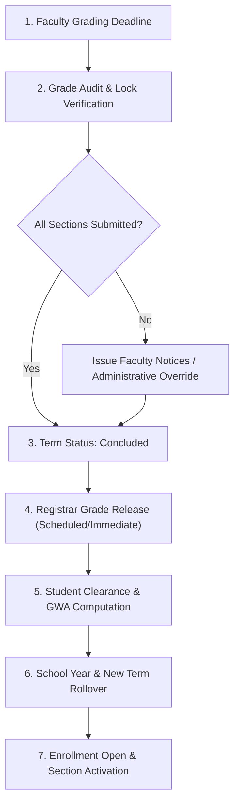

# AU-JAS LMS Operational Runbook: End-of-Term Transition & Grade Release SOP

## 1. Executive Overview & Purpose

This standard operating procedure (SOP) governs the formal transition between academic terms and school years within the **Arellano University (Jose Abad Santos Campus) Learning Management System (AU-JAS LMS)**.

Adherence to this protocol ensures:
- Transactional integrity across term boundaries.
- Full compliance with institutional grade release schedules and Registrar approvals.
- Accurate calculation of student Grade Point Averages (GPA), General Weighted Averages (GWA), and honours eligibility.
- Zero downtime or schedule collisions during semester rollovers.

---

## 2. Role & Responsibility Matrix

| Role | Primary Transition Responsibilities |
|---|---|
| **Academic Registrar** | Audits final section grade sheets, manages grade release schedules, executes grade releases (`fn_release_grading_period_now` / `fn_set_grading_period_release_at`), audits student clearances, and releases official transcripts. |
| **System Administrator** | Creates school years (`fn_create_school_year`), activates academic periods, advances term lifecycle statuses (`fn_advance_term_status`), and monitors server/database health. |
| **College Dean** | Enforces department faculty grading compliance, approves curricular section offerings for incoming terms, and oversees prerequisite validation. |
| **Faculty Member** | Finalizes assessment submissions, calculates final term grades (`fn_calculate_all_grades_for_period`), locks grade sheets, and submits records prior to the deadline. |

---

## 3. End-of-Term Transition Workflow

---

## 4. Phase-by-Phase Transition Procedure

### Phase 1: Pre-Transition Operational Audit (T-7 Days)
1. **Verify Section Assessment Completeness**:
   - Deans and Registrar inspect all active sections in `/dean/sections` and `/registrar/enrollments`.
   - Confirm all pending assessment submissions have been graded in `/faculty/sections/:id?tab=assessments`.
2. **Attendance Session Finalization**:
   - Verify that faculty members have closed all attendance sessions for the term.
   - Run audit on students with excessive unexcused absences to flag potential `DRP` (Dropped) conditions.
3. **Verify Grade Calculation**:
   - Ensure faculty have run `fn_calculate_all_grades_for_period` on all grading periods (e.g., Prelims, Midterms, Semi-Finals, Finals).
   - Confirm that raw percentage scores match the 10-rung transmutation ladder.

---

### Phase 2: Faculty Grade Locking & Term Conclusion (T-0 Days)
1. **Grade Sheet Locking**:
   - Once calculated and submitted, section grade sheets are locked in PostgreSQL (`fn_is_section_grading_locked`).
   - Any post-lock modifications require Dean and Registrar administrative clearance via `fn_reopen_section_grading` with an immutable entry in `grade_audit_logs`.
2. **Advance Term Lifecycle Status**:
   - Navigate to **Admin > Term Management** (`/admin/terms`).
   - Locate the active term.
   - Select **Advance Status** to transition the term state from `Active` to `Concluded` via `fn_advance_term_status`.
   - *Result*: Students can no longer submit assessments or discussions for the concluded term; historical records become read-only.

---

### Phase 3: Registrar Grade Release Execution
1. **Configure Scheduled Release vs Immediate Release**:
   - Navigate to **Registrar > Grade Release** (`/registrar/grade-release`).
   - To schedule an automated release at a designated timestamp:
     - Set the target date and time using `fn_set_grading_period_release_at`.
     - PostgreSQL cron/trigger handles publication to student portals once `now() >= release_at`.
   - To immediately release grades across all sections:
     - Click **Release Now** to execute `fn_release_grading_period_now`.
2. **Post-Release Student Portal Verification**:
   - Confirm student access on `/student/grades` and `/student/subjects/:id?tab=grades`.
   - Verify that transmuted grades (1.00–5.00, INC, DRP) and component breakdowns render correctly.

---

### Phase 4: School Year Rollover & New Term Activation
1. **Create / Activate School Year**:
   - Navigate to **Admin > School Year Management** (`/admin/school-years`).
   - If starting a new academic year, click **Create School Year** (`fn_create_school_year`):
     - Code: e.g. `2026-2027`
     - Label: `Academic Year 2026-2027`
     - Start Date / End Date: Define full academic duration.
     - Set **Active** status.
2. **Create / Activate New Term**:
   - Navigate to **Admin > Term Management** (`/admin/terms`).
   - Click **Create Term** (`fn_create_term`):
     - Associate with the active School Year.
     - Select Term Type (1st Semester, 2nd Semester, Summer).
     - Set Enrollment Window (`p_enrollment_start_date` to `p_enrollment_end_date`).
     - Set Grading Deadline (`p_grading_deadline`).
     - Set Evaluation Scope (Periodic / End of Term).
   - Set status to `Active` via `fn_advance_term_status`.

---

### Phase 5: Student Progression, Clearance & Transcripts
1. **Academic Clearance Processing**:
   - Registrar audits outstanding student obligations in `/registrar/records`.
   - Update `student_clearances` table for Library, Finance, and Department clearances.
2. **Official Transcript & GWA Computation**:
   - Term GWA and Cumulative GPA are computed dynamically via `fn_get_student_transcript` and `fn_get_student_insight`.
   - Students with passing marks earn cumulative course units towards degree program completion.
   - Students receiving `INC` have a mandatory 365-day completion window recorded in `special_grade_configs`.

---

## 5. Contingency & Emergency Rollback Procedures

### Scenario A: Disputed Grade Correction Post-Release
1. Faculty files an official Grade Amendment Request with Dean approval.
2. Registrar navigates to the specific section grade record.
3. System logs the prior grade, new grade, reason, changed timestamp, and modifying user ID directly into `grade_audit_logs`.
4. Stored procedure updates `section_final_grades` and recalibrates student GWA.

### Scenario B: Accidental Early Term Conclusion
1. If a term was concluded before all assessments were submitted:
   - System Administrator uses `fn_update_term` to restore status to `Active`.
   - Extend `p_grading_deadline` to accommodate the required buffer.
   - Broadcast an urgent announcement to affected faculty members.

---

## 6. Verification Checklist

- [ ] All faculty grade sheets locked and signed off.
- [ ] No unhandled submissions in grading queue.
- [ ] Grade release schedule or immediate release triggered.
- [ ] Concluded term status verified in database.
- [ ] New School Year and Term created and marked `Active`.
- [ ] Section enrollments open for the new semester.
- [ ] Student portal renders updated GWA and historical transcripts accurately.

